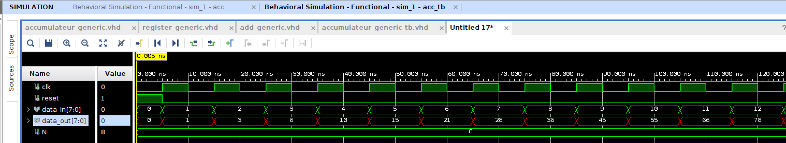

# Accumulateur_VHDL
L'accumulateur générique conçu en VHDL intègre un registre générique et un additionneur générique.
Le registre générique agit comme un élément de stockage contrôlé par une horloge et un signal de reset, tandis que l'additionneur générique réalise l'opération d'addition sur des nombres non signés. 
En combinant ces deux composants, l'accumulateur accumule progressivement les valeurs d'entrée à chaque cycle d'horloge, fournissant une sortie accumulée mise à jour à chaque étape.

Voici un exemple du résultat obtenu où les entrées varient de 0 à 12.

